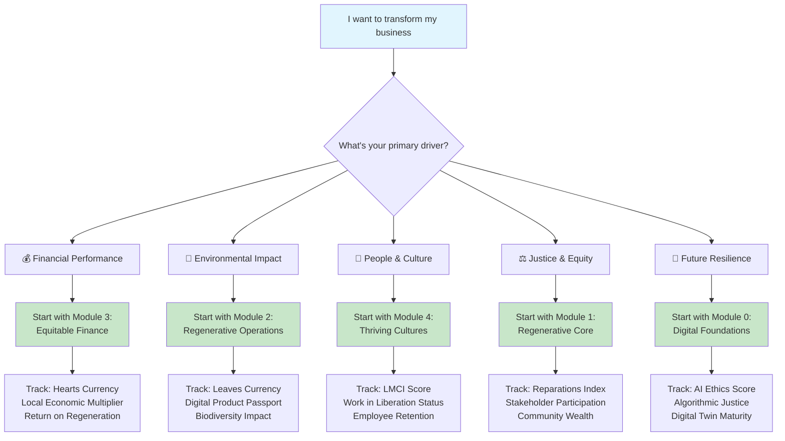

```mermaid
flowchart TD
    A[I want to transform my business] --> B{What's your primary driver?}
    
    B --> C[💰 Financial Performance]
    B --> D[🌱 Environmental Impact]
    B --> E[👥 People & Culture]
    B --> F[⚖️ Justice & Equity]
    B --> G[🔮 Future Resilience]
    
    C --> H[Start with Module 3:<br/>Equitable Finance]
    D --> I[Start with Module 2:<br/>Regenerative Operations]
    E --> J[Start with Module 4:<br/>Thriving Cultures]
    F --> K[Start with Module 1:<br/>Regenerative Core]
    G --> L[Start with Module 0:<br/>Digital Foundations]
    
    H --> M[Track: Hearts Currency<br/>Local Economic Multiplier<br/>Return on Regeneration]
    I --> N[Track: Leaves Currency<br/>Digital Product Passport<br/>Biodiversity Impact]
    J --> O[Track: LMCI Score<br/>Work in Liberation Status<br/>Employee Retention]
    K --> P[Track: Reparations Index<br/>Stakeholder Participation<br/>Community Wealth]
    L --> Q[Track: AI Ethics Score<br/>Algorithmic Justice<br/>Digital Twin Maturity]
    
    style A fill:#e1f5fe
    style H fill:#c8e6c9
    style I fill:#c8e6c9
    style J fill:#c8e6c9
    style K fill:#c8e6c9
    style L fill:#c8e6c9
```
