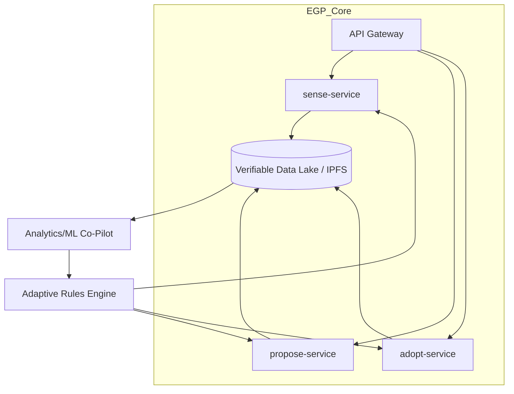

# EGP Implementation Appendix
## *Detailed Guidance for Communities, Organizations, and Technologists*

> **"Kubernetes for Governance"** - The EGP is a decentralized, modular, and open-source system designed for resilience and longevity, treating governance actions as verifiable, content-addressed data that flows through a network of interoperable services.

---

## Technical Architecture Overview

The EGP stack implements a vision of governance infrastructure that is:
- **Decentralized by Default**: No central server, no single point of failure
- **Radically Interoperable**: Universal data standards enable any EGP-compliant tool to communicate
- **Offline-First**: Designed for remote communities with intermittent connectivity
- **Verifiable & Secure**: All governance actions are transparent, tamper-proof, and attributable



### Technology Stack

| Layer | Technology | Purpose |
|---|---|---|
| **Data Standard** | JSON Schema + **IPLD** | Immutable, content-addressed governance actions |
| **APIs** | **GraphQL** + WebSub | Real-time subscriptions to governance events |
| **Identity** | **DID** + **UCAN** | Self-sovereign identity and decentralized permissions |
| **Execution** | **WASM** Modules | Portable, sandboxed policy logic (e.g., sunset checks) |
| **Storage** | **IPFS** + Local Sync | Distributed, offline-capable data persistence |
| **Networking** | **libp2p** | Peer-to-peer communication and discovery |

---

## Core Data Specification

### IPLD-Based Governance Actions

All EGP operations are stored as content-addressed, immutable records using IPLD (InterPlanetary Linked Data):

```json
{
  "@context": "https://schemas.egp.org/v1/",
  "@type": "GovernanceAction",
  "cid": "bafybeigdyrzt5sfp7udm7hu76uh7y26nf3efuylqabf3oclgtqy55fbzdi",
  "operation": "sense|propose|adopt",
  "id": "did:egp:action:uuid",
  "timestamp": "2025-01-15T14:30:00Z",
  "agent": {
    "did": "did:key:z6MkhaXgBZDvotDkL5257faiztiGiC2QtKLGpbnnEGta2doK",
    "type": "human|community|ai|sensor",
    "location": {
      "coordinates": [lat, lon],
      "jurisdiction": "ISO-3166-code",
      "bioregion": "watershed-identifier"
    }
  },
  "content": {
    "title": "brief-description",
    "description": "detailed-content",
    "severity": "local|regional|global", 
    "urgency": "immediate|weeks|months|years",
    "evidence": {
      "data": ["ipfs://hash1", "ipfs://hash2"],
      "sources": ["https://...", "did:web:..."],
      "attestations": ["did:key:witness1", "did:key:witness2"]
    },
    "affected_parties": ["did:community:...", "did:org:..."]
  },
  "relationships": {
    "responds_to": "ipfs://sense-signal-hash",
    "enables": ["ipfs://proposal-hash1", "ipfs://proposal-hash2"],
    "builds_on": ["ipfs://prior-adoption-hash"]
  },
  "metadata": {
    "cultural_context": "indigenous|western|hybrid|custom",
    "language": "ISO-639-code",
    "tags": ["searchable", "keywords"],
    "schema_version": "1.0.0"
  },
  "cryptographic_proof": {
    "signature": "...",
    "verification_method": "did:key:...",
    "proof_purpose": "assertionMethod"
  }
}
```

### Identity and Authorization (DID + UCAN)

EGP uses **Decentralized Identifiers (DIDs)** for identity and **User Controlled Authorization Networks (UCANs)** for permissions:

```json
{
  "issuer": "did:key:community-representative",
  "audience": "did:key:participant",
  "capabilities": [
    {
      "with": "did:community:village-name",
      "can": "egp:sense",
      "scope": ["local", "environmental"]
    },
    {
      "with": "did:community:village-name", 
      "can": "egp:propose",
      "scope": ["infrastructure", "education"]
    }
  ],
  "expiry": "2025-12-31T23:59:59Z",
  "proof": "..."
}
```

---

## GraphQL API Specification

The EGP uses GraphQL for flexible, real-time governance data access:

### Schema Definition

```graphql
type GovernanceAction {
  cid: String!
  operation: OperationType!
  id: ID!
  timestamp: DateTime!
  agent: Agent!
  content: Content!
  relationships: Relationships
  metadata: Metadata!
  cryptographicProof: Proof!
}

enum OperationType {
  SENSE
  PROPOSE
  ADOPT
}

type Agent {
  did: String!
  type: AgentType!
  location: Location!
}

type SenseSignal implements GovernanceAction {
  issue: String!
  severity: SeverityLevel!
  evidence: Evidence!
  affectedParties: [String!]!
  proposals: [Proposal!]! # Auto-generated relationships
}

type Proposal implements GovernanceAction {
  respondsTo: String! # CID of sense signal
  solution: String!
  testCriteria: [String!]!
  timeline: Duration!
  resourcesNeeded: [Resource!]!
  consentMechanism: String!
  sunsetDate: DateTime!
  adoptions: [Adoption!]! # Auto-generated relationships
}

type Adoption implements GovernanceAction {
  proposalId: String! # CID of proposal
  adoptingEntity: String! # DID
  trialPeriod: Duration!
  successMetrics: [String!]!
  monitoringPlan: String!
  reviewDates: [DateTime!]!
  exitStrategy: String!
  status: AdoptionStatus!
}
```

### Query Examples

```graphql
# Real-time subscription to new sense signals in a region
subscription LocalSenseSignals($region: String!) {
  senseSignals(region: $region) {
    cid
    content {
      title
      severity
    }
    agent {
      location {
        coordinates
      }
    }
    timestamp
  }
}

# Find proposals responding to a specific issue
query ProposalsForIssue($senseCid: String!) {
  proposals(respondsTo: $senseCid) {
    cid
    content {
      title
      solution
    }
    testCriteria
    sunsetDate
    adoptions {
      adoptingEntity
      status
    }
  }
}

# Track adoption outcomes across network
query AdoptionOutcomes($after: DateTime!) {
  adoptions(after: $after, status: COMPLETED) {
    proposalId
    adoptingEntity
    successMetrics
    outcomes {
      metric
      achieved
      evidence
    }
  }
}
```

### Mutations

```graphql
mutation CreateSenseSignal($input: SenseInput!) {
  sense(input: $input) {
    cid
    id
    validation {
      isValid
      errors
    }
  }
}

mutation CreateProposal($input: ProposalInput!) {
  propose(input: $input) {
    cid
    id
    validation {
      isValid
      errors
      sunsetWarnings
    }
  }
}

mutation AdoptProposal($input: AdoptionInput!) {
  adopt(input: $input) {
    cid
    id
    validation {
      isValid
      errors
      capacityWarnings
    }
  }
}
```

---

## WASM-Based Policy Execution

EGP uses WebAssembly (WASM) modules for portable, sandboxed execution of governance logic:

### Sunset Clause Enforcement

```rust
// Example WASM module for sunset clause validation
use wasm_bindgen::prelude::*;
use chrono::{DateTime, Utc};
use serde::{Deserialize, Serialize};

#[derive(Deserialize)]
struct Proposal {
    sunset_date: DateTime<Utc>,
    created_at: DateTime<Utc>,
    adoptions: Vec<Adoption>,
}

#[derive(Serialize)]
struct ValidationResult {
    is_valid: bool,
    warnings: Vec<String>,
    auto_expire: bool,
}

#[wasm_bindgen]
pub fn validate_proposal_lifecycle(proposal_json: &str) -> String {
    let proposal: Proposal = serde_json::from_str(proposal_json).unwrap();
    let now = Utc::now();
    
    let mut result = ValidationResult {
        is_valid: true,
        warnings: Vec::new(),
        auto_expire: false,
    };
    
    // Check if proposal has expired
    if now > proposal.sunset_date {
        result.auto_expire = true;
        result.warnings.push("Proposal has reached sunset date".to_string());
    }
    
    // Check if proposal is approaching expiration
    let days_until_sunset = (proposal.sunset_date - now).num_days();
    if days_until_sunset <= 30 && days_until_sunset > 0 {
        result.warnings.push(format!("Proposal expires in {} days", days_until_sunset));
    }
    
    // Check for active adoptions that would be affected
    let active_adoptions = proposal.adoptions.iter()
        .filter(|a| a.status == "active")
        .count();
        
    if active_adoptions > 0 && result.auto_expire {
        result.warnings.push(format!("{} active adoptions will be affected", active_adoptions));
    }
    
    serde_json::to_string(&result).unwrap()
}
```

### Custom Consent Mechanisms

```rust
// WASM module for community-specific consent validation
#[wasm_bindgen]
pub fn validate_consent(community_did: &str, proposal_cid: &str, consent_data: &str) -> String {
    // Load community-specific consent rules
    let consent_rules = load_community_rules(community_did);
    
    match consent_rules.mechanism {
        ConsentType::Consensus => validate_consensus_consent(consent_data),
        ConsentType::Majority => validate_majority_consent(consent_data),
        ConsentType::Indigenous => validate_indigenous_consent(consent_data),
        ConsentType::Custom(module) => execute_custom_module(module, consent_data),
    }
}
```

---

## Implementation Pathways

### Who Is This For?

This appendix provides detailed guidance for three primary audiences:

- **Communities** (neighborhoods, villages, Indigenous nations, cooperatives): Groups seeking to improve collective decision-making while maintaining cultural autonomy and connecting with broader networks.

- **Organizations** (nonprofits, companies, government agencies): Formal institutions wanting to adopt EGP principles internally and participate in cross-organizational coordination.

- **Technologists** (developers, platform builders, data scientists): Technical professionals building EGP-compatible tools, platforms, and infrastructure.

### For Communities

#### Phase 1: Cultural Integration (1-3 months)
- **Week 1:** Community introduction to EGP concepts with cultural translation
- **Week 2:** Map existing decision-making processes to EGP operations
- **Week 3-4:** Practice `sense()` documentation using local knowledge systems
- **Month 2-3:** Experiment with small `propose()` and `adopt()` cycles

**Technical Setup:**
- Deploy local EGP node (Raspberry Pi or community server)
- Configure community DID and UCAN permissions
- Set up offline-first data synchronization
- Customize UI/UX for local language and cultural protocols

#### Phase 2: Network Connection (3-6 months)  
- Connect with other EGP-compatible communities
- Share successful experiments via IPFS content addressing
- Participate in regional governance networks
- Develop community-specific WASM modules for local rules

#### Phase 3: Ecosystem Integration (6+ months)
- Full integration with global EGP network
- AI co-pilot assistance for pattern recognition
- Cross-cultural governance collaboration
- Innovation documentation and template sharing

### For Organizations

#### Assessment Phase
- **Technical Audit:** Evaluate current systems for EGP compatibility
- **Identity Integration:** Plan DID deployment for organizational agents
- **Data Sovereignty:** Assess requirements for internal vs. shared data
- **Cultural Translation:** Map organizational culture to EGP principles

#### Pilot Phase
- **Infrastructure Deployment:** Set up organizational EGP node
- **Staff Training:** GraphQL API integration and WASM module development
- **Cross-Org Networking:** Connect with partner organizations
- **Governance Integration:** Embed EGP in formal decision processes

#### Scale Phase
- **Full Network Participation:** Join global EGP ecosystem
- **AI Integration:** Deploy ML co-pilot for organizational intelligence
- **Innovation Contribution:** Open source successful organizational patterns
- **Regulatory Compliance:** Integrate with formal governance requirements

### For Technologists

#### Minimum Viable Implementation

**Core Node Requirements:**
```yaml
# docker-compose.yml for EGP node
version: '3.8'
services:
  egp-api:
    image: egp/graphql-gateway:latest
    ports:
      - "8080:8080"
    environment:
      - IPFS_GATEWAY=http://ipfs:5001
      - DID_RESOLVER=http://did-resolver:3000
    
  ipfs:
    image: ipfs/go-ipfs:latest
    ports:
      - "4001:4001"
      - "5001:5001"
    volumes:
      - ipfs-data:/data/ipfs
      
  did-resolver:
    image: egp/did-resolver:latest
    ports:
      - "3000:3000"
    
  wasm-runtime:
    image: egp/wasm-engine:latest
    ports:
      - "8081:8081"
```

**GraphQL Schema Implementation:**
```typescript
// Basic TypeScript implementation
import { GraphQLSchema, GraphQLObjectType, GraphQLString } from 'graphql';
import { PubSub } from 'graphql-subscriptions';
import * as IPFS from 'ipfs-core';

const pubsub = new PubSub();
const ipfs = await IPFS.create();

const SenseSignalType = new GraphQLObjectType({
  name: 'SenseSignal',
  fields: {
    cid: { type: GraphQLString },
    content: { type: ContentType },
    agent: { type: AgentType },
    timestamp: { type: GraphQLString },
  },
});

const resolvers = {
  Mutation: {
    sense: async (_, { input }) => {
      // Validate input against JSON schema
      const validated = await validateSenseInput(input);
      
      // Create IPLD object
      const ipldObj = createIPLDObject('sense', validated);
      
      // Store in IPFS
      const { cid } = await ipfs.dag.put(ipldObj);
      
      // Publish to subscribers
      pubsub.publish('SENSE_SIGNALS', { senseSignal: { ...ipldObj, cid } });
      
      return { cid: cid.toString(), validation: { isValid: true } };
    }
  },
  
  Subscription: {
    senseSignals: {
      subscribe: (_, { region }) => {
        return pubsub.asyncIterator(['SENSE_SIGNALS']);
      }
    }
  }
};
```

#### Advanced Platform Features

**AI Co-Pilot Integration:**
```python
# Example AI pattern recognition service
import numpy as np
from sklearn.cluster import DBSCAN
from transformers import AutoTokenizer, AutoModel
import ipfshttpclient

class EGPAICopilet:
    def __init__(self, ipfs_client):
        self.ipfs = ipfs_client
        self.tokenizer = AutoTokenizer.from_pretrained('sentence-transformers/all-MiniLM-L6-v2')
        self.model = AutoModel.from_pretrained('sentence-transformers/all-MiniLM-L6-v2')
    
    async def analyze_sense_patterns(self, region_filter=None):
        """Identify clustered issues that might benefit from coordinated response"""
        sense_signals = await self.fetch_recent_sense_signals(region_filter)
        
        # Embed descriptions using transformer model
        embeddings = []
        for signal in sense_signals:
            embedding = self.embed_text(signal['content']['description'])
            embeddings.append(embedding)
        
        # Cluster similar issues
        clustering = DBSCAN(eps=0.3, min_samples=2).fit(embeddings)
        
        # Suggest coordinated proposals for clustered issues
        clusters = self.group_by_cluster(sense_signals, clustering.labels_)
        suggestions = []
        
        for cluster in clusters:
            if len(cluster) > 1:  # Multiple similar issues
                suggestion = await self.generate_coordinated_proposal(cluster)
                suggestions.append(suggestion)
        
        return suggestions
    
    async def suggest_proposal_improvements(self, proposal_cid):
        """Analyze proposal against successful patterns"""
        proposal = await self.ipfs.dag.get(proposal_cid)
        similar_proposals = await self.find_similar_proposals(proposal)
        
        successful_patterns = [p for p in similar_proposals if p['outcome'] == 'successful']
        
        if successful_patterns:
            return self.extract_success_factors(successful_patterns)
        
        return {"suggestions": ["No similar patterns found - consider reaching out to the network for guidance"]}
```

**Offline-First Synchronization:**
```rust
// Rust implementation of offline-first sync
use libp2p::{NetworkBehaviour, Swarm, identity::Keypair};
use libp2p_gossipsub::{Gossipsub, GossipsubEvent};
use serde::{Deserialize, Serialize};

#[derive(Serialize, Deserialize)]
struct EGPMessage {
    operation: String,
    cid: String,
    timestamp: u64,
    source_peer: String,
}

pub struct EGPNetworkBehaviour {
    pub gossipsub: Gossipsub,
    pub pending_actions: Vec<EGPMessage>,
}

impl EGPNetworkBehaviour {
    pub async fn sync_when_online(&mut self) {
        // When connection is restored, sync pending actions
        for action in &self.pending_actions {
            let message = serde_json::to_vec(action).unwrap();
            self.gossipsub.publish("egp-sync", message).unwrap();
        }
        self.pending_actions.clear();
    }
    
    pub fn store_offline_action(&mut self, action: EGPMessage) {
        // Store action locally when offline
        self.pending_actions.push(action);
        // Also store in local IPFS for persistence
    }
}
```

---

## Cultural Adaptation Framework

### Traditional Governance Integration

**Indigenous Nations Example:**
```yaml
# Community-specific WASM module configuration
community_did: "did:egp:community:ojibwe-nation-example"
governance_model: "traditional_council"

consent_mechanism:
  type: "custom_wasm"
  module: "ojibwe_consensus.wasm"
  parameters:
    required_quorum: "seven_generations_represented"
    elder_approval: true
    seasonal_restrictions: 
      - "no_major_decisions_during_wild_rice_harvest"
    sacred_site_protection: true

validation_rules:
  sense_signals:
    - "land_based_observation_required"
    - "traditional_knowledge_integration"
  proposals:
    - "seven_generation_impact_assessment"
    - "cultural_protocol_compliance"
  adoptions:
    - "ceremonial_validation_when_appropriate"
    - "traditional_authority_recognition"
```

**Urban Community Example:**
```yaml
community_did: "did:egp:community:brooklyn-neighborhood"
governance_model: "participatory_democracy"

consent_mechanism:
  type: "hybrid"
  online_participation: 0.6  # 60% can participate online
  offline_participation: 0.4  # 40% need in-person options
  
decision_thresholds:
  sense_signals: "any_verified_resident"
  proposals: "minimum_3_endorsements"
  adoptions: "qualified_majority_with_minority_protection"

accessibility_requirements:
  - "multilingual_support"
  - "mobile_friendly_interface"
  - "senior_accessible_design"
  - "childcare_during_meetings"
```

### Cross-Cultural Coordination

**Translation Layer:**
```json
{
  "cultural_protocol_mapping": {
    "indigenous_consensus": {
      "maps_to": "qualified_consensus",
      "requires": ["elder_representation", "cultural_impact_assessment"],
      "respects": ["traditional_authority", "sacred_site_autonomy"]
    },
    "corporate_governance": {
      "maps_to": "stakeholder_approval", 
      "requires": ["fiduciary_responsibility", "shareholder_notice"],
      "respects": ["legal_compliance", "competitive_confidentiality"]
    },
    "neighborhood_democracy": {
      "maps_to": "participatory_decision",
      "requires": ["resident_verification", "impact_assessment"],
      "respects": ["minority_rights", "accessibility_standards"]
    }
  }
}
```

---

## Quality Assurance and Safeguards

### Cryptographic Verification

All EGP actions include cryptographic proofs:
```json
{
  "cryptographic_proof": {
    "type": "Ed25519Signature2020",
    "created": "2025-01-15T14:30:00Z",
    "verification_method": "did:key:z6MkhaXgBZDvotDkL5257faiztiGiC2QtKLGpbnnEGta2doK#z6MkhaXgBZDvotDkL5257faiztiGiC2QtKLGpbnnEGta2doK",
    "proof_purpose": "assertionMethod",
    "signature": "5PbLnDTbJwG7HHE5fkhj4_QzqCHGgr0B0v6KAzPt8X0zWZqEUXHbHKKzXy...",
    "challenge": "nonce-from-network",
    "domain": "egp.globalgovernanceframeworks.org"
  }
}
```

### Anti-Manipulation Measures

**Identity Verification:**
```rust
// DID-based identity verification
pub fn verify_community_member(agent_did: &str, community_did: &str) -> Result<bool, Error> {
    // Resolve DIDs and check membership attestations
    let agent = resolve_did(agent_did)?;
    let community = resolve_did(community_did)?;
    
    // Check for valid membership credential
    for credential in agent.credentials {
        if credential.issuer == community_did 
           && credential.type == "CommunityMembership"
           && !credential.is_expired() {
            return Ok(true);
        }
    }
    
    Err(Error::UnauthorizedAgent)
}
```

**Stake Requirements:**
```javascript
// Affected party consent validation
async function validateAffectedPartyConsent(action) {
  const affectedParties = action.content.affected_parties;
  
  for (const partyDid of affectedParties) {
    const consent = await checkConsentRecord(partyDid, action.cid);
    if (!consent || consent.status !== 'granted') {
      throw new Error(`Missing consent from affected party: ${partyDid}`);
    }
  }
  
  return true;
}
```

### Environmental Safeguards

**Planetary Boundary Integration:**
```wasm
// WASM module for planetary boundary checking
#[wasm_bindgen]
pub fn check_planetary_boundaries(proposal_json: &str) -> String {
    let proposal: Proposal = serde_json::from_str(proposal_json).unwrap();
    
    let mut warnings = Vec::new();
    
    // Check against current planetary boundary status
    if proposal.environmental_impact.climate_impact > 0.0 {
        let carbon_budget = get_remaining_carbon_budget();
        if proposal.environmental_impact.carbon_emissions > carbon_budget * 0.01 {
            warnings.push("Proposal exceeds 1% of remaining carbon budget".to_string());
        }
    }
    
    // Check biodiversity impact
    if proposal.environmental_impact.biodiversity_impact < -0.1 {
        warnings.push("Proposal may negatively impact biodiversity".to_string());
    }
    
    serde_json::to_string(&ValidationResult { warnings }).unwrap()
}
```

---

## Success Metrics and Evaluation

### Network Health Indicators

**Real-time Dashboard Queries:**
```graphql
query NetworkHealth($timeframe: Duration!) {
  networkMetrics(timeframe: $timeframe) {
    participationRate {
      unique_agents
      actions_per_agent
      geographic_distribution
    }
    
    problemResolution {
      sense_to_proposal_rate
      proposal_to_adoption_rate
      successful_adoption_rate
    }
    
    learningVelocity {
      pattern_replication_speed
      cross_cultural_adaptation_rate
      innovation_diffusion_time
    }
    
    systemResilience {
      network_uptime
      offline_capability_usage
      crisis_response_time
    }
  }
}
```

### Impact Assessment Framework

**Automated Outcome Tracking:**
```python
class EGPImpactTracker:
    def __init__(self, ipfs_client, ml_models):
        self.ipfs = ipfs_client
        self.models = ml_models
    
    async def track_adoption_outcomes(self, adoption_cid):
        adoption = await self.ipfs.dag.get(adoption_cid)
        
        # Continuous monitoring of success metrics
        metrics = adoption['successMetrics']
        outcomes = []
        
        for metric in metrics:
            # Use AI to assess metric achievement
            assessment = await self.models['outcome_assessor'].predict({
                'metric': metric,
                'context': adoption['context'],
                'evidence': await self.gather_evidence(adoption_cid, metric)
            })
            
            outcomes.append({
                'metric': metric,
                'achieved': assessment['achieved'],
                'confidence': assessment['confidence'],
                'evidence_quality': assessment['evidence_quality']
            })
        
        return outcomes
```

---

## Integration with Global Governance Frameworks

### GGF Ecosystem Alignment

**Constitutional Compliance:**
```yaml
# EGP compliance with Treaty for Our Only Home
treaty_compliance:
  human_rights: "UNDRIP_full_compliance"
  environmental_rights: "rights_of_nature_recognition"
  democratic_principles: "participatory_democracy_minimum"
  justice_escalation: "digital_justice_tribunal_integration"

framework_integration:
  tier_1_frameworks:
    - "regenerative_enterprise"
    - "institutional_regeneration"
    - "peace_and_conflict_resolution"
  
  coordination_mechanisms:
    - "cross_framework_sense_signals"
    - "shared_proposal_development"
    - "coordinated_adoption_experiments"
```

### Legal Framework Integration

**Smart Contract Integration:**
```solidity
// Ethereum smart contract for high-stakes EGP adoptions
pragma solidity ^0.8.0;

contract EGPAdoptionContract {
    struct Adoption {
        bytes32 proposalCID;
        address adoptingEntity;
        uint256 trialPeriod;
        bytes32[] successMetrics;
        uint256 reviewDate;
        bool isActive;
    }
    
    mapping(bytes32 => Adoption) public adoptions;
    
    event AdoptionCreated(bytes32 indexed adoptionCID, address indexed entity);
    event AdoptionReviewed(bytes32 indexed adoptionCID, bool successful);
    
    function createAdoption(
        bytes32 _adoptionCID,
        bytes32 _proposalCID,
        uint256 _trialPeriod,
        bytes32[] memory _successMetrics
    ) public {
        require(adoptions[_adoptionCID].adoptingEntity == address(0), "Adoption already exists");
        
        adoptions[_adoptionCID] = Adoption({
            proposalCID: _proposalCID,
            adoptingEntity: msg.sender,
            trialPeriod: _trialPeriod,
            successMetrics: _successMetrics,
            reviewDate: block.timestamp + _trialPeriod,
            isActive: true
        });
        
        emit AdoptionCreated(_adoptionCID, msg.sender);
    }
    
    function reviewAdoption(bytes32 _adoptionCID, bool _successful) public {
        Adoption storage adoption = adoptions[_adoptionCID];
        require(adoption.adoptingEntity == msg.sender, "Only adopting entity can review");
        require(block.timestamp >= adoption.reviewDate, "Review period not reached");
        
        adoption.isActive = false;
        emit AdoptionReviewed(_adoptionCID, _successful);
        
        // Integration with reputation system
        if (_successful) {
            updateReputationScore(msg.sender, 10);
        }
    }
}
```

---

## Development Roadmap

### Phase 1: Core Infrastructure (2025)
**Q1-Q2 Deliverables:**
- ✅ GraphQL API specification finalization
- ✅ IPLD data schema and validation
- ✅ Basic DID/UCAN identity system
- ✅ MVP WASM runtime for policy execution
- ✅ Offline-first synchronization protocol

**Q3-Q4 Deliverables:**
- 🔄 Community pilot deployments (5 communities)
- 🔄 Cross-platform interoperability testing
- 🔄 AI co-pilot pattern recognition system
- 🔄 Cultural adaptation framework implementation
- 🔄 Security audit and vulnerability assessment

### Phase 2: Network Effects (2026)
**Scaling Objectives:**
- 50+ communities actively using EGP
- Cross-cultural coordination success stories
- Integration with 3+ major governance platforms
- Advanced AI assistance for proposal optimization
- Academic research validation of effectiveness

### Phase 3: Ecosystem Integration (2027-2030)
**Future Vision:**
- Global network of 1000+ EGP-compatible communities
- Integration with formal government systems
- Autonomous AI agents participating in governance
- Interplanetary governance capability
- Post-human consciousness integration protocols

---

## Getting Started

### Quick Deployment

```bash
# Clone the EGP implementation
git clone https://github.com/GlobalGovernanceFrameworks/egp.git
cd egp

# Deploy with Docker Compose
docker-compose up -d

# Verify deployment
curl http://localhost:8080/health

# Initialize your first community
egp init --community "Your Community Name" \
         --location "lat,lon" \
         --cultural-context "western|indigenous|hybrid"
```

### Community Quick Start

```bash
# For Raspberry Pi deployment
curl -sSL https://get.egp.org/install.sh | bash
egp start --offline-first

# For local development
npm install -g @egp/cli
egp dev init
egp dev start --watch
```

### Your First EGP Actions

```bash
# Create a sense signal
egp sense "Neighborhood park needs better lighting" \
          --severity local \
          --evidence ./photos/dark_path.jpg

# Propose a solution  
egp propose --responds-to <sense-cid> \
           "Install solar-powered LED lights" \
           --test-criteria "Improved visibility after sunset" \
           --sunset "2025-06-01"

# Adopt for trial
egp adopt <proposal-cid> \
         --trial-period "3 months" \
         --success-metrics "Crime reduction, community satisfaction"
```

---

## Integration Examples

### Municipal Government Integration

```javascript
// Integration with existing city systems
const EGPMunicipalBridge = {
  async syncWithPermitSystem(senseSignal) {
    // Automatically create permit applications for infrastructure proposals
    if (senseSignal.content.tags.includes('infrastructure')) {
      const permit = await cityAPI.createPermit({
        type: 'community_improvement',
        description: senseSignal.content.description,
        location: senseSignal.agent.location
      });
      
      return permit.id;
    }
  },
  
  async updateCouncilAgenda(proposals) {
    // Add successful community proposals to council agenda
    const validated = proposals.filter(p => p.adoptions.length > 2);
    await councilAPI.addAgendaItems(validated);
  }
};
```

### Corporate Integration

```typescript
// Enterprise governance integration
interface CorporateEGPConfig {
  stakeholderGroups: string[];
  complianceRequirements: string[];
  escalationThresholds: {
    financial: number;
    legal: boolean;
    operational: string;
  };
}

class EnterpriseEGPAdapter {
  async validateProposal(proposal: Proposal): Promise<ValidationResult> {
    // Check against corporate governance requirements
    const compliance = await this.checkCompliance(proposal);
    const stakeholderApproval = await this.getStakeholderConsent(proposal);
    
    return {
      isValid: compliance.passed && stakeholderApproval.sufficient,
      requirements: compliance.additionalRequirements,
      escalations: this.checkEscalationTriggers(proposal)
    };
  }
}
```

### Cross-Platform Interoperability

```yaml
# Platform bridge configuration
bridges:
  decidim:
    api_endpoint: "https://participate.barcelona.cat/api"
    mapping:
      sense: "proposals"
      propose: "debates"  
      adopt: "budgets"
      
  consul:
    api_endpoint: "https://decide.madrid.es/api"
    mapping:
      sense: "proposals"
      propose: "debates"
      adopt: "voting"
      
  custom_platform:
    webhook_url: "https://your-platform.org/egp-webhook"
    auth_method: "oauth2"
```

---

## Advanced Features

### Automated Pattern Recognition

```python
# AI-powered governance insights
class GovernanceIntelligence:
    def __init__(self):
        self.pattern_analyzer = PatternAnalyzer()
        self.success_predictor = SuccessPredictor()
        
    async def analyze_network_health(self):
        """Generate insights about governance network performance"""
        signals = await self.fetch_recent_signals()
        
        insights = {
            'participation_trends': self.analyze_participation(signals),
            'resolution_patterns': self.analyze_resolution_rates(signals),
            'cultural_adaptation': self.analyze_cultural_success(signals),
            'innovation_diffusion': self.track_idea_spread(signals)
        }
        
        return insights
        
    async def suggest_interventions(self, community_did):
        """Recommend actions to improve community governance"""
        community_data = await self.get_community_history(community_did)
        similar_communities = await self.find_similar_communities(community_data)
        
        successful_patterns = self.extract_success_patterns(similar_communities)
        
        return {
            'recommendations': successful_patterns,
            'pilot_suggestions': self.generate_pilot_ideas(successful_patterns),
            'capacity_building': self.identify_skill_gaps(community_data)
        }
```

### Regulatory Compliance Layer

```wasm
// WASM module for regulatory compliance checking
#[wasm_bindgen]
pub fn check_regulatory_compliance(proposal_json: &str, jurisdiction: &str) -> String {
    let proposal: Proposal = serde_json::from_str(proposal_json).unwrap();
    let regulations = load_jurisdiction_rules(jurisdiction);
    
    let mut compliance_result = ComplianceResult::new();
    
    // Check environmental regulations
    if proposal.environmental_impact.is_some() {
        compliance_result.environmental = check_environmental_compliance(
            &proposal, &regulations.environmental
        );
    }
    
    // Check social impact requirements
    if proposal.affected_parties.len() > regulations.stakeholder_threshold {
        compliance_result.social = check_stakeholder_requirements(
            &proposal, &regulations.social
        );
    }
    
    // Check financial thresholds
    if proposal.budget > regulations.financial_threshold {
        compliance_result.financial = require_financial_disclosure(&proposal);
    }
    
    serde_json::to_string(&compliance_result).unwrap()
}
```

### Blockchain Integration for High-Stakes Decisions

```solidity
// Smart contract for transparent, immutable adoption tracking
pragma solidity ^0.8.0;

contract EGPAdoptionRegistry {
    struct AdoptionRecord {
        bytes32 proposalCID;
        address adoptingEntity;
        uint256 adoptionDate;
        uint256 trialPeriod;
        string[] successMetrics;
        bool isCompleted;
        bool wasSuccessful;
    }
    
    mapping(bytes32 => AdoptionRecord) public adoptions;
    mapping(address => bytes32[]) public entityAdoptions;
    
    event AdoptionRegistered(bytes32 indexed cid, address indexed entity);
    event AdoptionCompleted(bytes32 indexed cid, bool successful);
    
    function registerAdoption(
        bytes32 adoptionCID,
        bytes32 proposalCID,
        uint256 trialPeriod,
        string[] memory successMetrics
    ) external {
        require(adoptions[adoptionCID].adoptingEntity == address(0), "Already registered");
        
        adoptions[adoptionCID] = AdoptionRecord({
            proposalCID: proposalCID,
            adoptingEntity: msg.sender,
            adoptionDate: block.timestamp,
            trialPeriod: trialPeriod,
            successMetrics: successMetrics,
            isCompleted: false,
            wasSuccessful: false
        });
        
        entityAdoptions[msg.sender].push(adoptionCID);
        emit AdoptionRegistered(adoptionCID, msg.sender);
    }
    
    function completeAdoption(bytes32 adoptionCID, bool successful) external {
        AdoptionRecord storage adoption = adoptions[adoptionCID];
        require(adoption.adoptingEntity == msg.sender, "Unauthorized");
        require(!adoption.isCompleted, "Already completed");
        require(
            block.timestamp >= adoption.adoptionDate + adoption.trialPeriod,
            "Trial period not complete"
        );
        
        adoption.isCompleted = true;
        adoption.wasSuccessful = successful;
        
        emit AdoptionCompleted(adoptionCID, successful);
        
        // Update reputation score
        if (successful) {
            _updateReputationScore(msg.sender, 10);
        }
    }
}
```

---

## Success Metrics and Network Health

### Core Metrics Dashboard

```graphql
query NetworkHealthDashboard($timeframe: Duration!) {
  networkHealth(timeframe: $timeframe) {
    participation {
      uniqueAgents
      actionsPerAgent
      geographicDistribution
      culturalDiversity
    }
    
    effectivenessRates {
      senseToProposalConversionRate
      proposalToAdoptionRate
      adoptionSuccessRate
      averageResolutionTime
    }
    
    networkEffects {
      crossCommunityLearning
      patternReplicationRate
      innovationDiffusionSpeed
      culturalAdaptationSuccess
    }
    
    systemHealth {
      nodeUptime
      dataIntegrity
      consensusMechanismPerformance
      offlineResilienceScore
    }
  }
}
```

### Impact Assessment Framework

```python
class EGPImpactTracker:
    def __init__(self, ipfs_client, analytics_engine):
        self.ipfs = ipfs_client
        self.analytics = analytics_engine
    
    async def measure_community_outcomes(self, community_did, timeframe):
        """Track real-world impact of EGP adoption in communities"""
        adoptions = await self.get_community_adoptions(community_did, timeframe)
        
        impact_metrics = {}
        
        for adoption in adoptions:
            if adoption.status == 'completed':
                # Quantitative outcomes
                metrics = await self.assess_quantitative_outcomes(adoption)
                
                # Qualitative community feedback
                feedback = await self.gather_community_feedback(adoption)
                
                # Long-term sustainability indicators
                sustainability = await self.assess_sustainability(adoption)
                
                impact_metrics[adoption.cid] = {
                    'quantitative': metrics,
                    'qualitative': feedback,
                    'sustainability': sustainability,
                    'unexpected_outcomes': await self.identify_emergent_effects(adoption)
                }
        
        return {
            'community_growth': self.calculate_capacity_growth(impact_metrics),
            'problem_resolution': self.calculate_resolution_effectiveness(impact_metrics),
            'network_contribution': self.calculate_knowledge_sharing(impact_metrics),
            'cultural_adaptation': self.assess_cultural_integration(impact_metrics)
        }
```

---

## Security and Trust

### Cryptographic Verification

```typescript
// Comprehensive verification system
class EGPVerificationService {
    async verifyGovernanceAction(actionCID: string): Promise<VerificationResult> {
        const action = await this.ipfs.dag.get(actionCID);
        
        // Verify cryptographic signature
        const signatureValid = await this.verifySignature(action);
        
        // Verify agent authorization
        const authValid = await this.verifyAuthorization(action.agent.did, action.operation);
        
        // Verify affected party consent
        const consentValid = await this.verifyAffectedPartyConsent(action);
        
        // Verify data integrity
        const integrityValid = await this.verifyDataIntegrity(action);
        
        return {
            isValid: signatureValid && authValid && consentValid && integrityValid,
            details: {
                signature: signatureValid,
                authorization: authValid,
                consent: consentValid,
                integrity: integrityValid
            },
            trustScore: this.calculateTrustScore(action)
        };
    }
}
```

### Anti-Manipulation Safeguards

```rust
// Sybil resistance and manipulation detection
#[wasm_bindgen]
pub fn detect_manipulation_patterns(actions_json: &str) -> String {
    let actions: Vec<GovernanceAction> = serde_json::from_str(actions_json).unwrap();
    
    let mut flags = Vec::new();
    
    // Check for coordinated inauthentic behavior
    let agent_pattern = analyze_agent_behavior_patterns(&actions);
    if agent_pattern.suspicious_coordination > 0.8 {
        flags.push("Potential coordinated inauthentic behavior detected".to_string());
    }
    
    // Check for rapid proposal farming
    let proposal_timing = analyze_proposal_timing(&actions);
    if proposal_timing.spam_likelihood > 0.7 {
        flags.push("Unusual proposal submission patterns detected".to_string());
    }
    
    // Check for astroturfing in adoptions
    let adoption_pattern = analyze_adoption_authenticity(&actions);
    if adoption_pattern.astroturf_score > 0.6 {
        flags.push("Potential artificial support pattern detected".to_string());
    }
    
    serde_json::to_string(&ManipulationReport { flags }).unwrap()
}
```

---

## Future Development Roadmap

### 2025: Foundation & Early Adoption
- ✅ Core protocol specification finalization
- ✅ Reference implementation in Rust/TypeScript
- 🔄 First community pilot deployments (10 communities)
- 🔄 Basic AI co-pilot for pattern recognition
- 🔄 Mobile-first interface development
- 📋 Security audit and vulnerability assessment

### 2026: Network Effects & Scaling
- 📋 100+ communities actively using EGP
- 📋 Cross-platform interoperability with major civic tech platforms
- 📋 Advanced AI assistance for proposal optimization
- 📋 Multi-language support and cultural adaptation tools
- 📋 Integration with formal government systems (5 cities)
- 📋 Academic research validation of effectiveness

### 2027-2030: Ecosystem Maturation
- 📋 1000+ communities in global EGP network
- 📋 Corporate governance integration at scale
- 📋 AI agents as governance participants
- 📋 Interplanetary governance capabilities
- 📋 Integration with emerging tech (AR/VR, brain-computer interfaces)
- 📋 Self-evolving protocol with community-driven development

---

## Contributing & Community

### How to Contribute

We welcome contributors of all kinds:

**🔧 Developers**: Core protocol development, client libraries, integration tools
**🎨 Designers**: User experience, accessibility, cultural adaptation interfaces  
**🧠 Researchers**: Governance theory, network analysis, impact measurement
**🌍 Community Builders**: Pilot deployments, training materials, adoption support
**📝 Documentation**: Technical writing, translation, educational content

### Development Guidelines

```bash
# Fork and clone the repository
git clone https://github.com/yourusername/egp.git
cd egp

# Install dependencies
npm install

# Run tests
npm test

# Start development server
npm run dev

# Submit a pull request with:
# - Clear description of changes
# - Tests for new functionality  
# - Documentation updates
# - Cultural sensitivity review if applicable
```

### Community Spaces

- **🗣️ Discord**: [https://discord.gg/MjnzCfh4mM](https://discord.gg/MjnzCfh4mM) - Real-time community discussion
- **📚 Documentation**: [https://github.com/GlobalGovernanceFrameworks/egp/tree/main/docs](https://github.com/GlobalGovernanceFrameworks/egp/tree/main/docs) - Technical documentation and guides
- **🐛 Issues**: [GitHub Issues](https://github.com/GlobalGovernanceFrameworks/egp/issues) - Bug reports and feature requests

### Code of Conduct

EGP follows the principles of the [Contributor Covenant](https://www.contributor-covenant.org/). We are committed to providing a welcoming and inclusive environment for all contributors, regardless of background, identity, or experience level.

---

## Conclusion: Building the Grammar of Coordination

The Emergent Governance Protocol represents more than a technical implementation—it's a bet on humanity's capacity for coordinated wisdom. By providing a simple, universal grammar for governance, EGP enables the kind of cross-cultural, cross-scale coordination our global challenges demand.

Just as the early internet protocols enabled the explosion of human knowledge sharing, EGP aims to enable an explosion of human coordination capacity. The three verbs—sense, propose, adopt—are simple enough for any community to understand, yet powerful enough to coordinate planetary civilization.

We're not building a platform to rule them all. We're building the commons infrastructure that allows all platforms, all communities, all governance systems to speak with each other. We're building it like Wikipedia, not Uber—open, collaborative, and for the common good.

The future of governance is not centralized control, but coordinated autonomy. EGP provides the protocol layer that makes that future possible.

**Ready to start? Join us at [https://globalgovernanceframeworks.org](https://globalgovernanceframeworks.org) and help build the coordination infrastructure for a thriving planetary civilization.**

---

*This appendix is a living document. As the EGP evolves through community feedback and real-world deployment, these implementation details will continue to adapt and improve. Version tracking and community input ensure this remains a useful resource for implementers across all contexts.*

**Last Updated**: July 2025  
**Document Version**: 1.0  
**Protocol Version**: 0.1.0-alpha  
**Community Contributions Welcome**: [GitHub](https://github.com/GlobalGovernanceFrameworks/egp) | [Discord](https://discord.gg/MjnzCfh4mM)
